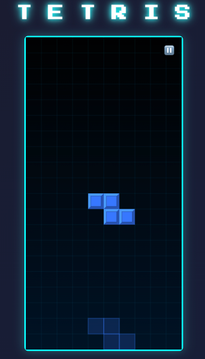

# KI-gestütztes Tetris-Spiel

## Über das Projekt

Dieses Repository enthält ein voll funktionsfähiges Tetris-Spiel, erstellt mit Hilfe von KI in unter 30 Minuten. Das Projekt dient als Demonstration für den Einsatz von KI in der Softwareentwicklung und wurde für einen TikTok-Beitrag im Rahmen der Code.Design-Initiative erstellt.

## Features

- Vollständig responsive, mobile-first Design
- Touch-Steuerung für Mobilgeräte
- Tastatursteuerung für Desktop
- 3D-Blockeffekte und visuelles Feedback
- Ghost-Piece zur besseren Platzierung
- Linien-Lösch-Animationen
- Punktesystem und Level-Mechanik
- Game Over-Erkennung und Neustart-Funktion

## Technologie

Das Spiel wurde mit Vanilla JavaScript, HTML5 und CSS3 erstellt, ohne zusätzliche Frameworks oder Bibliotheken. Die Entscheidung für diese Technologien basiert auf folgenden Vorteilen:

- **Plattformunabhängigkeit** - läuft in jedem modernen Browser
- **Kein Setup erforderlich** - einfach HTML-Datei öffnen und spielen
- **Leichtgewichtig** - unter 100 KB Gesamtgröße
- **Einfache Weitergabe** - funktioniert mit einfachem Link-Teilen
- **Lernfreundlich** - Code ist gut strukturiert und kommentiert

## Wie das Projekt entstanden ist

Dieses Projekt wurde durch KI-Unterstützung entwickelt, wobei der Entwicklungsprozess etwa 30 Minuten dauerte. Die Hauptschritte waren:

1. Grundlegende Anforderungen an das Spiel definieren
2. KI-gestützte Implementierung der Kernfunktionen
3. Optimierung für mobile Geräte
4. Verfeinerung des visuellen Designs
5. Polishing und Fehlerbehebung

## Code.Design Camp

Dieses Projekt ist ein Beispiel für die Art von Projekten, die bei den [Code.Design Camps](https://code.design/) entstehen können. Code.Design ist eine Initiative, die Workshops und Camps für Jugendliche zwischen 15 und 20 Jahren anbietet, um Programmieren, Design und Produktmanagement zu erlernen.

Bei den mehrtägigen Camps können Teilnehmer:
- Eigene digitale Produkte entwickeln
- Mit erfahrenen Coaches zusammenarbeiten
- Einblicke in digitale Berufsfelder erhalten
- Teil einer Community Gleichgesinnter werden

## Wichtig zu beachten

Dieses Projekt zeigt, dass KI ein mächtiges Werkzeug für Entwickler sein kann - aber die Vision und das technische Grundlagenwissen müssen vom Menschen kommen. KI ist ein Partner im Entwicklungsprozess, kein Ersatz für echtes Verständnis.

Die Code.Design Camps bieten die perfekte Umgebung, um dieses Grundlagenwissen zu erlangen und deine eigene digitale Zukunft zu gestalten.

## Spielanleitung

### Mobile
- Tippen zum Drehen
- Nach links/rechts wischen zum Bewegen
- Nach unten wischen zum schnelleren Fallen
- Nach oben wischen für sofortiges Ablegen
- Alternativ die Touch-Steuerelemente am unteren Bildschirmrand verwenden

### Desktop
- Pfeiltasten zum Bewegen und Drehen
- Leertaste für sofortiges Ablegen
- P zum Pausieren

## Los geht's!

1. Repository klonen oder als ZIP herunterladen
2. Die `index.html` Datei in einem Browser öffnen
3. Spielen und Spaß haben!

## Lizenz

MIT-Lizenz - Frei verwendbar für eigene Projekte und Weiterentwicklungen.

---

*"KI schreibt den Code, aber die Vision muss von dir kommen."*